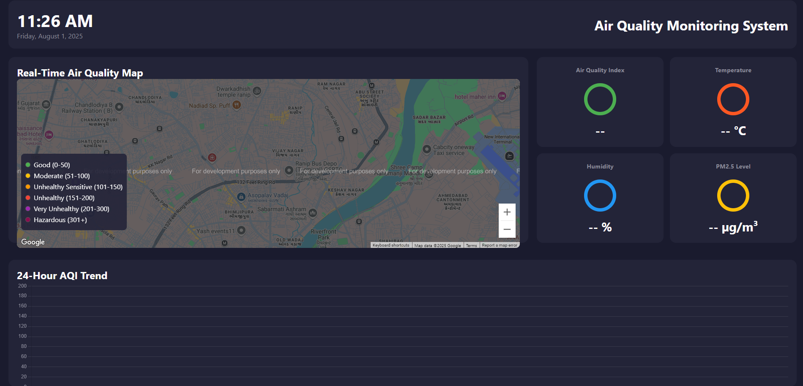
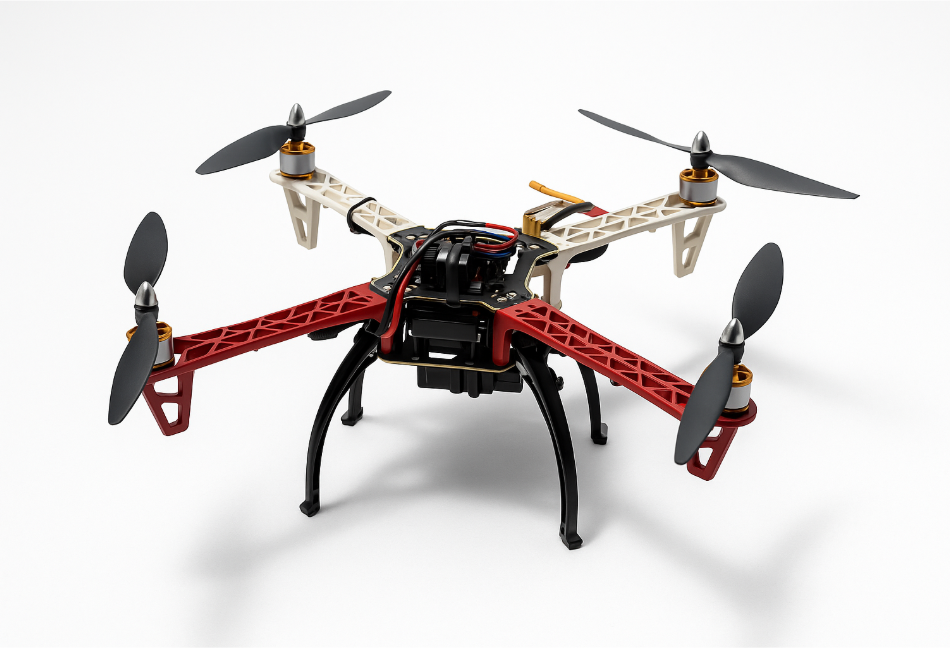

# 🌍 Air Quality Monitoring Drone 🚁📡

A fully autonomous drone system for **real-time air quality monitoring**, built with an **ESP32**, environmental sensors, GPS, and a custom dashboard. Designed for **local data collection**, **analysis**, and **mapping** without cloud dependencies.

---


## 📸 Project Overview

The Air Quality Monitoring Drone is an IoT-based drone system that collects atmospheric data like **PM2.5, PM10, CO₂, NH₃, NOx, temperature, and humidity**, and maps it using **GPS**. Data is transmitted in real-time over **Wi-Fi/Bluetooth** and visualized on a local **web dashboard with charts and map integration**.

---

## 🔧 Hardware Used

- **ESP32** (Wi-Fi + BLE microcontroller)
- **PMS5003** – PM2.5 & PM10 dust sensor
- **MQ135** – Air quality sensor (CO₂, NH₃, NOx)
- **AM2302 (DHT22)** – Humidity & temperature
- **Ublox NEO-6M** – GPS Module
- **DIY Drone Kit** – Frame, motors, battery, flight controller
- **Power Source** – Drone Li-Po battery

---
## 📊 Features
📡 Real-time AQI data collection

🗺️ Location tagging with GPS

📶 Wireless data transmission (Wi-Fi/Bluetooth)

📈 Web-based dashboard (no cloud dependency)

🔋 Battery powered (drone-integrated)

## 🧪 Applications
Urban air quality mapping

Pollution hotspot detection

Smart city deployment

Disaster response (e.g. fire, gas leaks)
## 🌐 Dashboard Preview

<!-- Add screenshots -->


## Drone


---
## 📍 Made with purpose by passionate engineers for a cleaner tomorrow.
## 🧠 System Architecture

1. Sensors collect environmental and location data.
2. ESP32 processes and formats the data.
3. Data is transmitted over local Wi-Fi.
4. Web dashboard displays:
   - Real-time graphs (PM2.5, PM10, etc.)
   - GPS-based mapping of AQI

---

## 🛠️ Setup Instructions

### ✅ Prerequisites

- Arduino IDE / PlatformIO
- ESP32 board support
- Sensor libraries:
  - `Adafruit_Sensor`, `DHT`, `TinyGPS++`, etc.

### 🚀 Installation

```bash
git clone https://github.com/yourusername/aqi-monitoring-drone.git
cd aqi-monitoring-drone


